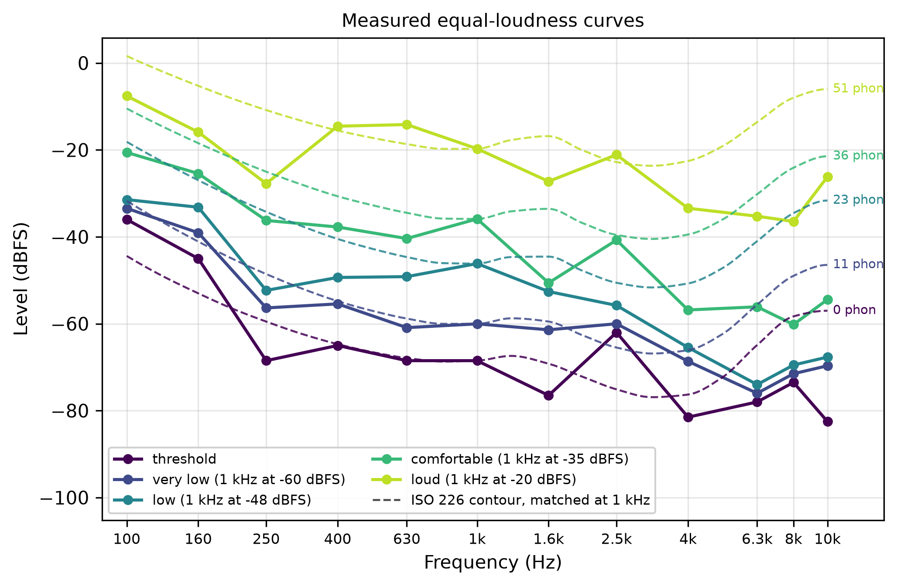
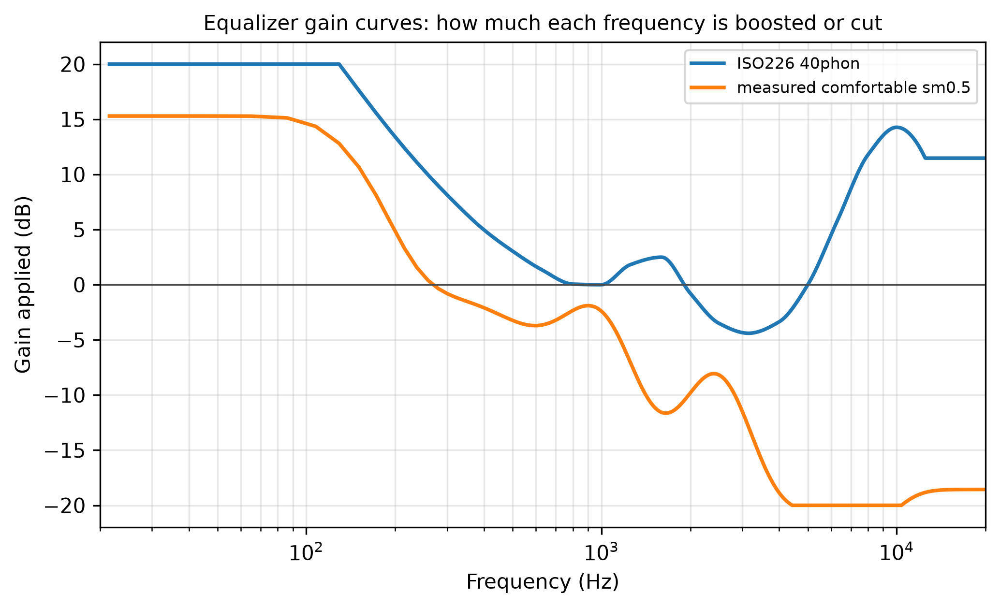

# Project 1 Report: Equal-Loudness Curves and an ELC-Based Equalizer

**Wenrui Chen, EN.520.645 Audio Signal Processing, Fall 2026**

### 1. Overview

In this project I measured my own hearing threshold and four equal-loudness curves with a listening test written in Python, compared them with the ISO 226 curves, and built an equalizer that takes a curve as its parameter. Then I listened to what it does to speech, music, noise and a sweep. The code is in `~/PycharmProjects/ASP Project/Project1` (Python 3.14). `python main.py` shows a menu with three options: the listening test, the equalizer on the test sounds, and a 10 s microphone recording that gets equalized. 

### 2. Setup and a note about levels

I used a MacBook Air with wired headphones, 44.1 kHz and 16-bit wav files. I do not have a sound level meter, so all levels in this report are digital levels in dBFS (dB relative to full scale, where 0 dBFS is the largest value a sample can have). I set the system volume once at the start and did not touch it again, so the relation between digital level and real loudness stayed fixed during the test, although I only know that relation by ear. Because of this my curves can be compared with ISO 226 in shape but not in absolute level. The ISO 226:2003 formula in `src/iso226.py` is the reference throughout.

### 3. Measuring my threshold and equal-loudness curves

I used 12 test frequencies from 100 Hz to 10 kHz, about half an octave apart and a little denser between 2 and 5 kHz, where the ear is supposed to be most sensitive. I measured five curves: the threshold, and four curves with the 1 kHz reference at -60, -48, -35 and -20 dBFS, which I call "very low", "low", "comfortable" and "loud". Each tone lasts 0.7 s with a short fade in and out, and the frequencies come in random order.

For calibration, the program first plays the 1 kHz tone at -35 dBFS and I set the system volume until it feels comfortable. Then it plays the -20 dBFS tone so I can check that "loud" is loud but not painful. After that the volume stays fixed, and nothing is ever played above -1 dBFS.

The threshold test is simple. The program plays a tone and I answer yes or no. If I heard it the level goes down, otherwise it goes up, with steps of 8 dB, then 4, then 2. After 6 reversals (changes of direction) the threshold is the average of the last four reversal levels. I found out later that this is called an adaptive staircase.

For the other four curves I hear the 1 kHz reference, a pause, then the test tone, and press keys to change the test tone in 1 or 3 dB steps until the two sound equally loud. The test tone starts at a random level. As a sanity check the program also asks me to match the 1 kHz tone against itself, where the right answer is 0 dB. I got 0.0, +1.8, -0.9 and +0.3 dB at the four levels, so my judgements seem reliable to about 1 or 2 dB. The whole test took about 20 minutes.

Figure 1 shows the five measured curves in dBFS, with ISO 226 contours drawn dashed for comparison. To decide which ISO contour belongs to which of my curves I assumed that my threshold at 1 kHz is the ISO threshold at 1 kHz (2.4 dB SPL). With that assumption my four reference levels correspond to about 11, 23, 36 and 51 phon, and each dashed contour is shifted so that it passes through my 1 kHz point. The values are in `figures/elc_measured_table.md`.

What I noticed:

- The low-frequency side looks like the standard. At 100 Hz I needed about 32 dB more than at 1 kHz for the threshold, 27 dB more on the very low curve, and only 12 to 15 dB more on the three louder curves. The quieter the level, the more bass the ear needs.
- From 250 Hz to about 2.5 kHz my curves are flat within about 5 dB.
- Below 1 kHz my curves follow the dashed ISO contours; the two quietest ones need about 10 dB more at 100 Hz than the standard says. Above 2.5 kHz the ISO contours rise again toward 8 to 10 kHz, but mine keep falling, and at 10 kHz they sit 20 to 30 dB below the standard. Since this happens on all five curves in the same way, it is most likely the headphones and not my hearing (see Section 6).
- Some single points are noisy, for example 1.6 kHz on the comfortable curve sits 10 to 15 dB below its neighbours. With more time I would repeat each match and average.

### 4. The equalizer

An equalizer is a tool that changes the volume of different frequency ranges in a sound. The bass, mid and treble knobs on a stereo are a simple equalizer. In this project the knobs are replaced by an equal-loudness curve. The curve tells how much louder each frequency has to be to sound as loud as 1 kHz, so if I subtract the value at 1 kHz from the curve, I get directly the gain in dB that the equalizer should apply at each frequency. For the ISO 40 phon curve this means about +20 dB at 100 Hz, about 0 dB around 1 kHz, and a few dB of cut around 3 kHz, where the ear is most sensitive. The goal is that after the equalizer, every frequency in the sound is perceived at about the same loudness.

Each frame is multiplied by a window, converted to the frequency domain with an FFT, and every frequency bin is multiplied by the gain that the curve asks for at that frequency. Then the frame is converted back with an inverse FFT and the frames are added back together. 

The curve is only known at a few frequencies (29 for ISO 226, 12 for my own) but a 2048 sample frame has 1025 frequency bins, so the gain has to be interpolated. I do this on a log frequency axis with a cubic interpolation, because the curve points are spaced evenly in octaves, not in Hz. Outside the range of the curve the gain keeps the edge value, and below 20 Hz it fades to 0 dB so that DC and rumble are not boosted. The window is the square root of a Hann window, applied once before the FFT and once after the inverse FFT, with 50 percent overlap. The two windows multiplied add up to a constant across the overlaps, so a frame that the equalizer leaves alone comes back exactly as it went in.

I built two equalizers for the listening tests: one with the ISO 226 curve at 40 phon, and one with my own measured comfortable curve (smoothed). Figure 2 shows the gain curve that each of them actually applies. The curve is the same for every input file. What differs between files is how much energy they have in the boosted and the cut regions.

### 5. Listening to the equalized sounds

I ran both equalizers on four test files (text-to-speech, an 8 s synthetic pop loop, pink noise, a logarithmic sweep) and on a 10 s recording of my own voice. All outputs are in `audio/output/` and the level change per band is in `figures/eq_summary.md`. In every case the change goes in the direction the gain curve predicts: more bass, a little more treble, and quieter mids because the output is matched to the input RMS.

- Speech and my voice: fuller and warmer, still easy to understand, because speech has little bass for the boost to work on. 
- Music: with my own equalizer the loop sounds very muffled and bass heavy. My curve boosts everything below about 200 Hz by 15 dB and cuts everything above 2 kHz by up to 20 dB (Figure 2), so the kick and bass get louder while the hi-hat and the top of the chords are almost removed. After RMS matching the mids drop by 18 dB and the highs by 27 dB. The music loop already has most of its energy in the bass, so a curve that boosts bass further makes it dominate. The ISO curve gives the same kind of result but less extreme, because it boosts the treble instead of cutting it.
- My measured curve: clearly duller on every file, because it cuts 4 to 10 kHz by 15 to 20 dB where the ISO curve rises. A curve measured over headphones includes the headphone response.
- Pink noise: my equalizer reduces the noise clearly, the hiss almost disappears, while the ISO equalizer does not. The reason is that the hissy part of pink noise sits above 2 kHz, which my curve cuts by up to 20 dB , whereas the ISO curve boosts that region by more than 10 dB, so the hiss stays.
- Sweep: at low volume the original only becomes audible near 100 Hz, the equalized one from around 30 Hz.

### 6. Conclusions

My curves have the same shape as ISO 226 in the low and mid frequencies, including the growing bass boost as the level goes down, with about 1 to 2 dB of uncertainty in my judgements. The high-frequency part is dominated by the headphones and cannot be separated from my hearing without a calibrated measurement. 

The equalizer takes any curve as its parameter, applies it in the frequency domain, and works on files and on the live microphone with 46 ms of delay. The listening tests confirm the direction the curves predict for every input, but the full curve is too strong for music because it is defined for single tones. Scaling the curve down with the strength parameter brings back the bass and treble at low volume without drowning the mids.
