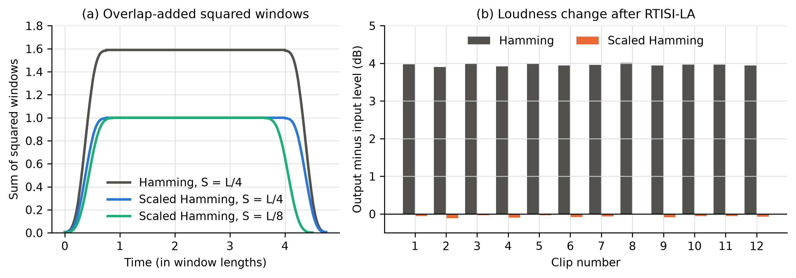
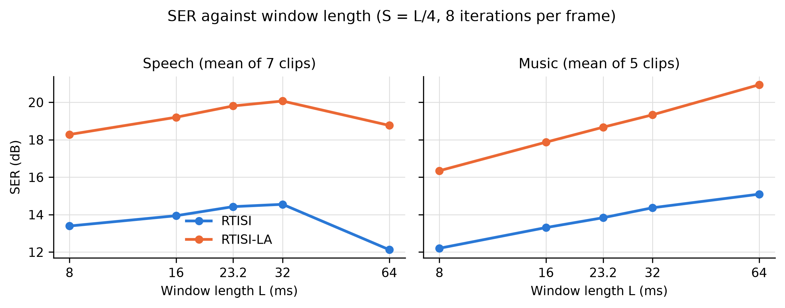
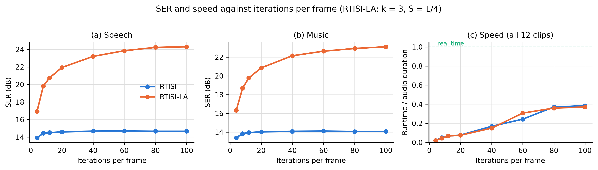
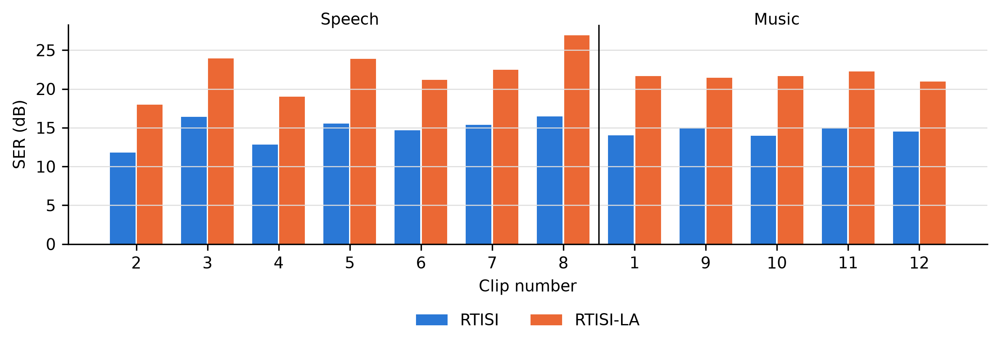

# Signal Reconstruction from the STFT Magnitude with RTISI and RTISI-LA

**Wenrui Chen, EN.520.645 Audio Signal Processing, Fall 2026**

### 1. Outline

When a sound is turned into a spectrogram, each short frame gets a magnitude and a phase for every frequency, and many processing steps, such as noise reduction, time stretching and source separation, only work on the magnitude. The phase is then lost, and the signal has to be rebuilt from the magnitude alone.

In this project I did this for the 12 given clips: 7 speech clips, audio2 to audio8, and 5 music clips, audio1 and audio9 to audio12. I computed the short-time Fourier transform, or STFT, of each clip, kept only its magnitude, and rebuilt the signal with the two algorithms from Sections II and III of Zhu et al. 2007: RTISI, real-time iterative spectrogram inversion, and RTISI-LA, RTISI with look-ahead. The goal is a reconstruction that sounds close to the original, with few artifacts and the same loudness.

The work went in this order:

1. Load the clips and label them as speech or music.
2. Build the STFT with the scaled Hamming window of the paper and check that the window scaling keeps the loudness.
3. Implement RTISI.
4. Implement RTISI-LA with the asymmetric analysis window.
5. Choose the evaluation measures: SER, loudness change, speed, and listening.
6. Run parameter experiments: window length, overlap and initial phase window, number of look-ahead frames, number of iterations.
7. Rebuild all 12 clips with the chosen settings and compare speech with music.

The code is in the submitted Project2 folder and uses Python with NumPy. `python main.py` runs the scaling check and the experiments of Section 7 and then produces the final audio of Section 8.

### 2. Data

The speech clips are 3 to 10 s long at 32 kHz, except audio7, a 99 s speech recording at 44.1 kHz with some background music. The music clips are 19 to 36 s long at 44.1 kHz. Stereo clips are averaged to mono. I labelled the clips from their spectrograms: speech shows short voiced segments with moving harmonics and pauses, music shows long steady harmonic lines. Clips 2 and 4 are speech with strong broadband background noise.

### 3. STFT and window scaling

Each frame has $L$ samples, frames start $S$ samples apart, $S$ being the hop size, and the FFT length is $L$. I add $L - S$ zeros before the signal, so every sample is covered by the same number of frames, and cut them off after reconstruction. The window is the scaled Hamming window of Equation 6 in the paper:

$$
w(n) = \frac{2\sqrt{S}}{\sqrt{(4a^2+2b^2)L}}\left(a + b\cos\frac{2\pi n}{L}\right),\quad 1 \le n \le L,\quad a = 0.54,\ b = -0.46
$$
The window is applied twice, once when a frame is analysed and once when the rebuilt frame is overlap-added, so the output equals the input times the sum of the overlapping $w^2$. The factor in front makes this sum exactly 1 for $L = 4S$ and for $L = 8S$. For a plain Hamming window at $L = 4S$ the sum is $4a^2 + 2b^2 = 1.59$, which makes the output 4.0 dB too loud.

Figure 1a shows the overlap-added $w^2$: flat at 1.000 for the scaled window at both hop sizes, 1.59 for the plain one. In Figure 1b every clip is rebuilt from its magnitude with RTISI-LA using each window: with the plain window the output is 3.90 to 4.01 dB louder, with the scaled window it changes by only −0.01 to −0.11 dB. With the true phase kept, STFT followed by overlap-add returns the original with a largest sample error below $10^{-15}$.

**Figure 1.** a: Sum of the squared, overlap-added windows. b: Loudness change of every clip after RTISI-LA with the plain and the scaled Hamming window, using $k = 3$, 2 iterations per step and $L = 23.2$ ms.

### 4. RTISI

RTISI builds the signal one frame at a time from left to right. When frame $m$ is built, frames $m-1$ to $m-3$ already overlap its first three quarters; their overlap-added sum inside frame $m$ is the partial frame. Frame $m$ takes its phase from this partial frame, so it continues the waveform that is already there:

1. $\text{buffer} \leftarrow \text{partial frame}$.
2. Multiply the buffer by $w$, take the FFT and keep only the phase; combine it with the target magnitude of frame $m$ and take the inverse FFT. This is the new estimate of frame $m$.
3. $\text{buffer} \leftarrow \text{estimate} \times w + \text{partial frame}$. The buffer is reset to this sum at every iteration, not accumulated.
4. Repeat steps 2 and 3, then keep the last buffer as the output in frame $m$'s range.

One iteration is one FFT and one inverse FFT. For the first frame the partial frame is zero, so the first phase is zero.

### 5. RTISI-LA

RTISI fixes frame $m$ using only earlier frames. RTISI-LA keeps frame $m$ changeable until $k$ future frames have also been estimated. At each step the new frame $m+k$ enters a buffer that holds frames $m$ to $m+k$, and all buffered frames are improved together for $p$ iterations: the committed output and all current estimates, each multiplied by $w$, are overlap-added, every buffered frame is read back from this sum with its analysis window, and its phase goes through the same FFT, magnitude replacement and inverse FFT as in RTISI. Then frame $m$ is committed to the output and the buffer moves one frame on. Each frame gets $p(k+1)$ iterations, which cost $2p(k+1)$ FFTs, and each look-ahead frame adds $S$ samples of delay, 8 ms with the final settings. With $k = 0$ this is RTISI.

When frame $m+k$ enters the buffer, only earlier frames overlap it, so its partial frame fades out towards the end and gives a worse first phase. Following Section II-D of the paper, this newest frame is analysed with the time-reversed envelope of its partial frame. Every frame reaches the output as $\text{estimate} \times w$ and the estimate already carries one $w$, so this envelope is the sum of $w^2$ of the earlier overlapping frames. Applying it makes the windowed partial frame symmetric. From the second iteration on, the envelope also includes the new frame's own $w^2$. All other buffered frames use the scaled Hamming window. The window costs no extra computation.

### 6. Evaluation measures

- **SER**, Equation 7 of the paper: $\mathrm{SER} = 10\log_{10}\dfrac{\sum_{m,k} |X(m,k)|^2}{\sum_{m,k} \big(|X(m,k)| - |Y(m,k)|\big)^2}$, where $X$ and $Y$ are the STFTs of the original and the reconstruction with the same window and hop, summed over all $L$ FFT bins. It compares magnitudes only, which is all the algorithm can match: $x$ and $-x$, or any two signals that differ only in phase, have the same spectrogram.
- **Loudness change**: RMS level of the reconstruction minus that of the original, in dB. It tests the "similar loudness" requirement and the window scaling directly.
- **Speed**: runtime divided by clip duration on a MacBook Air. Below 1 means faster than real time.
- **Listening**: original against both reconstructions, for artifacts and loudness.

### 7. Parameter experiments

Every experiment runs on all 12 clips and reports the mean SER of the speech clips and of the music clips. Unless stated otherwise, $L = 23.2$ ms, the paper's value, which is 744 samples at 32 kHz and 1024 at 44.1 kHz; $S = L/4$, $k = 3$, and the asymmetric window is on.

#### 7.1 Window length

**Figure 2.** SER against window length with $S = L/4$ and 8 iterations per frame; RTISI-LA uses $k = 3$ with 2 iterations per step.

For speech, SER peaks at 32 ms with 20.07 dB for RTISI-LA and falls to 18.77 dB at 64 ms. For music it keeps rising up to 20.94 dB at 64 ms. Speech changes pitch and formants within tens of milliseconds, so a 64 ms frame mixes different sounds, while held music notes gain from the finer frequency resolution of a long window. One setting has to serve both, and 32 ms is the best for speech and the second best for music, so I chose $L = 32$ ms, which is 1024 samples at 32 kHz and 1408 at 44.1 kHz.

#### 7.2 Overlap and initial phase window

| RTISI-LA, $k = 3$, 2 iterations per step | Speech SER, dB | Music SER, dB |
|---|---|---|
| Normal window, $S = L/8$ | 16.35 | 15.63 |
| Normal window, $S = L/4$ | 17.56 | 17.07 |
| Asymmetric window, $S = L/8$ | 19.87 | 18.85 |
| Asymmetric window, $S = L/4$ | 19.81 | 18.67 |

The asymmetric window adds 2.3 dB for speech and 1.6 dB for music at no extra cost, close to the 2 dB in Table I of the paper. With the normal window, $S = L/8$ is worse than $L/4$: at $L/4$ the 3 look-ahead frames are all the future frames that overlap the current one, at $L/8$ seven overlap and only three are used. With the asymmetric window, $L/8$ is less than 0.2 dB better but needs twice as many frames. I kept $S = L/4$ with the asymmetric window.

#### 7.3 Number of look-ahead frames

With 2 iterations per step, going from $k = 0$ to $k = 3$ raises SER by about 4 dB, from 15.85 to 19.81 dB for speech and from 15.07 to 18.67 dB for music. From $k = 3$ to $k = 10$ it rises only 1.6 to 1.9 dB more, to 21.43 and 20.55 dB, while the runtime grows linearly from 0.01 to 0.07 of the audio duration. At $L = 4S$, $k = 3$ covers exactly the future frames that overlap the current one; frames further ahead act on it only indirectly. I kept $k = 3$, which adds 24 ms of delay.

#### 7.4 Number of iterations: RTISI against RTISI-LA

**Figure 3.** SER against total iterations per frame for speech in a and music in b, and runtime divided by audio duration in c. RTISI-LA uses $k = 3$, so 8 iterations per frame means 2 per step.

RTISI stops improving after about 20 iterations: for speech it gives 13.92 dB at 4 iterations, 14.59 at 20 and 14.66 at 100, and music is about 0.6 dB lower. It only sees earlier frames, and once the current frame fits them, more iterations change nothing. RTISI-LA keeps rising: 19.81 dB at 8, 21.94 at 20, 24.23 at 80, and 26.67 dB with $k = 10$ and 20 per step, which is 220 iterations per frame. With 8 iterations RTISI-LA is already about 5 dB above RTISI with 100. Figure 3c shows that at equal iterations per frame both run at the same speed, since the cost is the number of FFTs. Up to 100 iterations both stay below 0.4 of real time, and the 220-iteration setting takes about as long as the audio.

| SER, dB | Iterations per frame | Speech | Music | Paper speech | Paper music |
|---|---|---|---|---|---|
| RTISI | 8 | 14.43 | 13.84 | 19.12 | 14.72 |
| RTISI | 80 | 14.66 | 14.05 | 19.32 | 14.90 |
| RTISI-LA | 8 | 19.81 | 18.67 | 24.65 | 19.60 |
| RTISI-LA | 80 | 24.23 | 22.93 | 28.40 | 23.62 |

The pattern matches Table IV of the paper. My music values are within 1 dB of the paper; my speech values are 4 to 5 dB lower, and the two noisy speech clips are the lowest of all clips, as Section 8.2 shows.

For the final run I chose 20 iterations per frame for both methods, which means 5 per step for RTISI-LA. RTISI has reached its plateau there, so both get the same computation and RTISI is at its best; going to 80 would add about 2 dB to RTISI-LA for four to five times the runtime.

### 8. Final reconstruction

#### 8.1 Results

Final settings: scaled Hamming window, $L = 32$ ms, $S = L/4$, 20 iterations per frame; RTISI-LA with $k = 3$ and the asymmetric window.

| Method | Clips | Mean SER, dB | SER range, dB | Loudness change, dB | Runtime / duration |
|---|---|---|---|---|---|
| RTISI | Speech | 14.72 | 11.78 to 16.44 | −0.72 | 0.07 to 0.08 |
| RTISI | Music | 14.49 | 13.95 to 14.99 | −0.73 | 0.07 to 0.08 |
| RTISI-LA | Speech | 22.19 | 18.00 to 26.93 | −0.03 | 0.07 to 0.08 |
| RTISI-LA | Music | 21.59 | 20.93 to 22.28 | −0.03 | 0.07 to 0.08 |

**Figure 4.** SER of every clip with the final settings.

RTISI-LA is 6.1 to 10.5 dB better than RTISI on every clip, at the same speed, 12 to 14 times faster than real time. It also keeps the loudness, while RTISI comes out about 0.7 dB quieter with the same window. RTISI fixes each frame before the later frames exist; their phases then do not fully agree with it, and the disagreeing parts partly cancel in the overlap-add. The loudness change in the look-ahead experiment shows the same trend, from −0.30 dB at $k = 0$ to −0.06 dB at $k = 3$.

#### 8.2 Speech and music

On average speech and music reach almost the same SER with RTISI-LA, 22.19 against 21.59 dB, and in every parameter experiment speech was about 1 dB above music. Speech spreads much more, from 18.00 to 26.93 dB against 20.93 to 22.28 dB for music: the clean clip audio8 is the best of all, and the noisy clips audio2 and audio4, at 18.00 and 18.98 dB, are the worst. Noise has no steady harmonic structure, so one frame's phase says little about the next, which is exactly what both algorithms rely on. The two kinds of signals also want different windows: speech is best at 32 ms, music keeps improving up to 64 ms.

#### 8.3 Listening

I compared the original with both reconstructions for the clean speech clip audio8, the noisy speech clip audio2 and the music clips audio10 and audio1. On audio8, audio2 and audio1 I could not hear any difference between the original, RTISI and RTISI-LA. On audio10 the RTISI version sounded a little less airy than the original and RTISI-LA; otherwise it was the same. This fits the 0.7 dB loudness loss of RTISI: the parts that cancel in the overlap-add are probably weak, fast-changing components such as reverberation and high harmonics, which give a sound its airy quality.

### 9. Conclusions

The scaled Hamming window makes the sum of the squared, overlapping windows equal to 1, so the reconstruction keeps the original loudness, while a plain Hamming window makes it 4 dB too loud. RTISI reaches its limit after about 20 iterations per frame at about 14.5 dB SER and comes out 0.7 dB quieter, because each frame is fixed before the frames after it are known. RTISI-LA with 3 look-ahead frames and the asymmetric analysis window reaches about 22 dB SER at the same cost, keeps the loudness, and keeps improving with more iterations or look-ahead. Both run more than 10 times faster than real time, and both sound close to the original; the only difference I heard was a slightly less airy RTISI on one music clip. Speech and music reach a similar mean SER, but speech prefers a 32 ms window while music keeps gaining from longer ones, and noisy speech is the hardest case for both algorithms.

